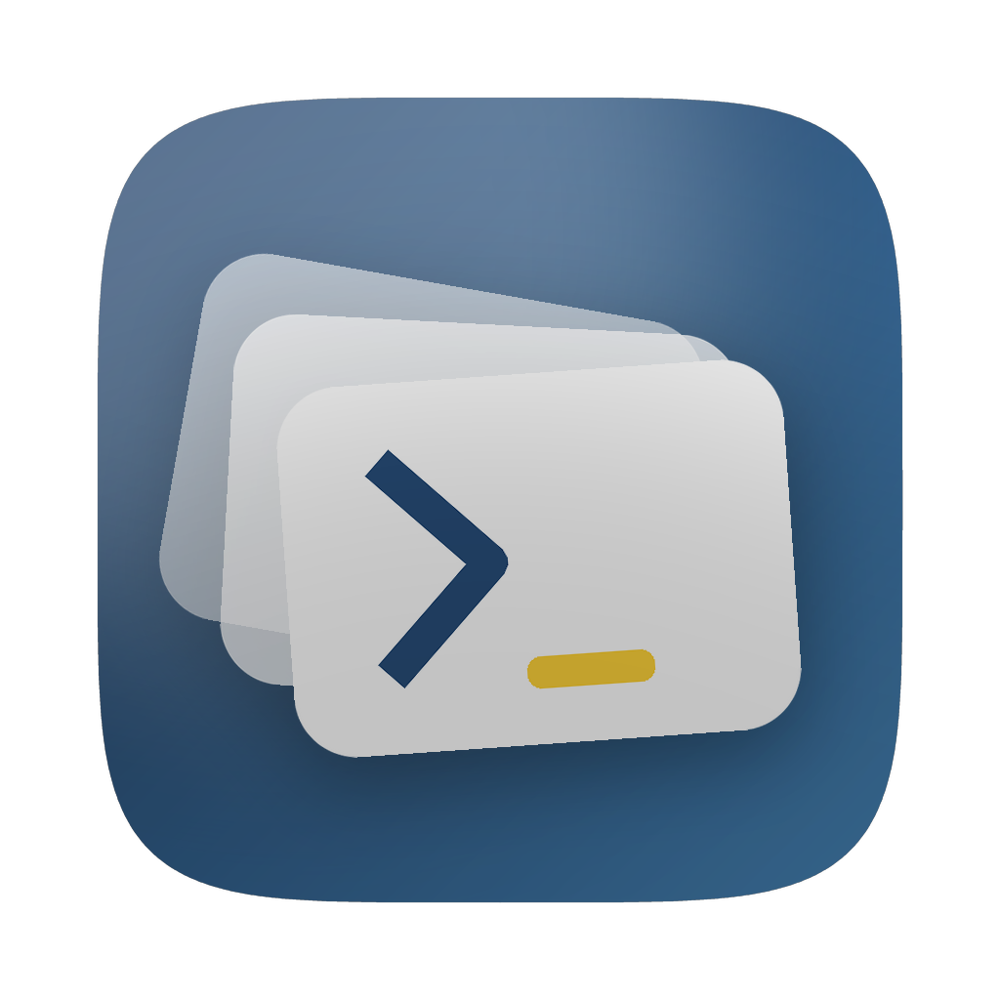
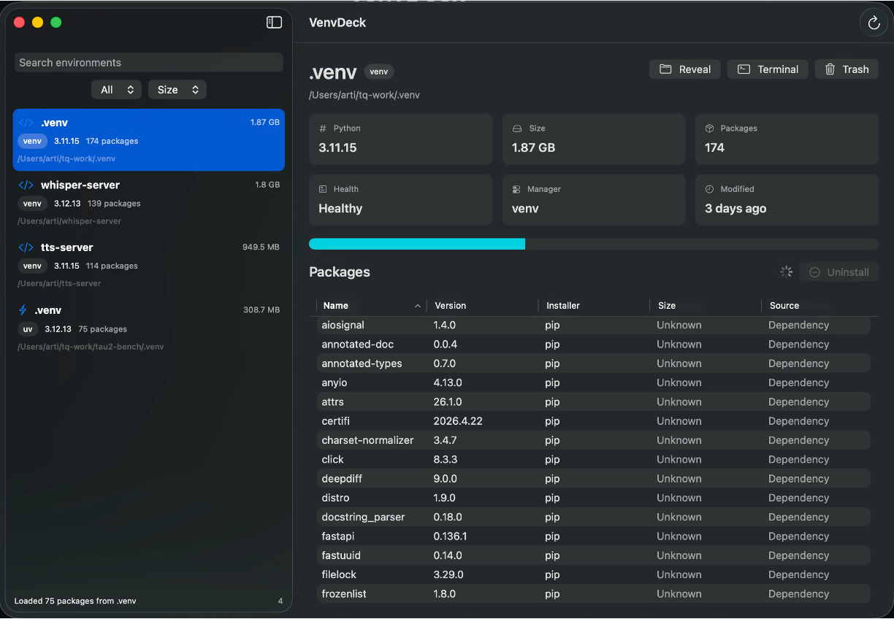

<p align="center">
  
</p>

<h1 align="center">VenvDeck</h1>

<p align="center">
  <strong>The macOS control room for every Python environment hiding on your machine.</strong>
</p>

<p align="center">
  Find the virtualenvs eating your disk. See what Python they run. Inspect their packages. Open a shell. Clean them up.
</p>

<p align="center">
  
</p>

<p align="center">
  <a href="https://github.com/sayyidfareed/VenvDeck/raw/main/dist/VenvDeck.dmg"><strong>Download Apple Silicon DMG</strong></a>
  ·
  <a href="https://github.com/sayyidfareed/VenvDeck/releases">Releases</a>
  ·
  <a href="#build-from-source">Build from Source</a>
</p>

## Why VenvDeck

Python environments multiply quietly. A `.venv` here, a Poetry cache there, a pyenv install from six months ago, a pipx tool you forgot you installed, and suddenly gigabytes are gone.

VenvDeck gives you a native macOS dashboard for that sprawl: beautiful, searchable, sortable, and practical enough to actually clean house.

## What It Does

- Scans common Python environment locations across your Mac.
- Detects `venv`, `virtualenv`, `conda`, `pyenv`, Poetry, uv, and pipx environments.
- Shows Python version, manager/type, path, health, modified date, package count, and disk usage.
- Recovers package inventory even when an environment is partly broken by reading `site-packages` metadata directly.
- Recovers Python versions from interpreters, activation scripts, `pyvenv.cfg`, and `lib/pythonX.Y` folders.
- Sorts and filters environments by size, name, Python version, and package count.
- Sorts package tables by name, version, installer, size, and source.
- Reveals environments in Finder.
- Opens an in-app activated command console for the selected environment.
- Opens an external Terminal window with the selected environment activated.
- Moves disposable environments to Trash after confirmation.
- Uninstalls packages with confirmation using `pip` when possible, with a metadata-based fallback for orphaned envs.

## Download

Apple Silicon users can download the unsigned DMG directly from the repo:

```text
https://github.com/sayyidfareed/VenvDeck/raw/main/dist/VenvDeck.dmg
```

After the first tagged release, the release page will also provide the DMG:

```text
https://github.com/sayyidfareed/VenvDeck/releases
```

## Install on macOS

1. Download `VenvDeck.dmg`.
2. Open the DMG.
3. Drag `VenvDeck.app` into `Applications`.
4. Launch VenvDeck.
5. Click the scan button and let it map your Python environments.

### Gatekeeper Note

VenvDeck currently ships as an ad-hoc signed, non-notarized DMG. macOS may warn that the app is from an unidentified developer.

To open it:

1. Try launching VenvDeck once.
2. Go to `System Settings > Privacy & Security`.
3. Approve VenvDeck, or Control-click the app and choose `Open`.

If macOS says `"VenvDeck" is damaged and can't be opened`, clear the download quarantine flag after dragging it to Applications:

```sh
xattr -dr com.apple.quarantine /Applications/VenvDeck.app
```

Then Control-click `VenvDeck.app` and choose `Open`.

Future releases can add Developer ID signing and notarization for a smoother public install.

## Safety Model

VenvDeck is intentionally cautious.

- Environment deletion moves folders to Trash instead of permanently deleting them.
- Package uninstall asks for confirmation.
- Package uninstall uses `pip` when a working interpreter is available.
- Metadata-only uninstall only removes files listed in the package `RECORD` file and moves them to Trash.
- Pyenv Python installations and unknown records are protected from direct environment deletion.

## Build From Source

Clone the repo:

```sh
git clone https://github.com/sayyidfareed/VenvDeck.git
cd VenvDeck
```

Run the app:

```sh
swift run VenvDeck
```

Run tests:

```sh
swift test
```

Build the Apple Silicon unsigned DMG:

```sh
bash scripts/package_dmg.sh
```

The packaged app is written to:

```text
dist/VenvDeck.dmg
```

Verify the DMG:

```sh
hdiutil verify dist/VenvDeck.dmg
```

Build for a different architecture by overriding `ARCHS`:

```sh
ARCHS=x86_64 bash scripts/package_dmg.sh
```

## GitHub Release Flow

Tagged releases automatically build, test, package, and attach `VenvDeck.dmg` to the GitHub Release.

```sh
git tag v0.1.0
git push origin v0.1.0
```

The workflow lives at:

```text
.github/workflows/release.yml
```

## Project Layout

```text
Sources/VenvDeck/          SwiftUI macOS app
Sources/VenvDeckCore/      Scanner, classifier, package parser, disk usage logic
Tests/VenvDeckCoreTests/   Core scanner and parser tests
scripts/package_dmg.sh     Unsigned DMG build script
scripts/make_icon.py       App icon generation helper
docs/assets/               README assets
```

## Status

VenvDeck is an MVP with a real native app shell, working scanner, package inventory, cleanup actions, in-app terminal console, external Terminal activation, app icon, DMG packaging, and GitHub Releases workflow.

The next big polish pass is signing/notarization, richer terminal emulation, scan scope controls, and a more visual storage map.

## License

VenvDeck is released under the [MIT License](LICENSE).
